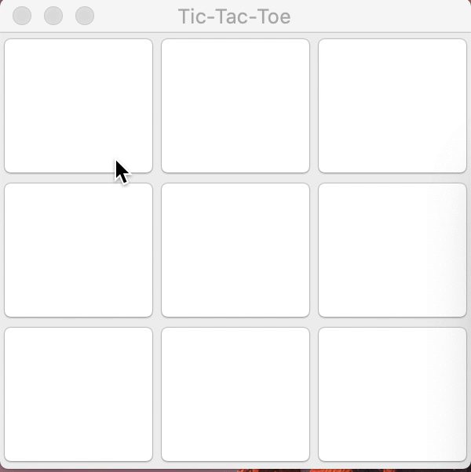
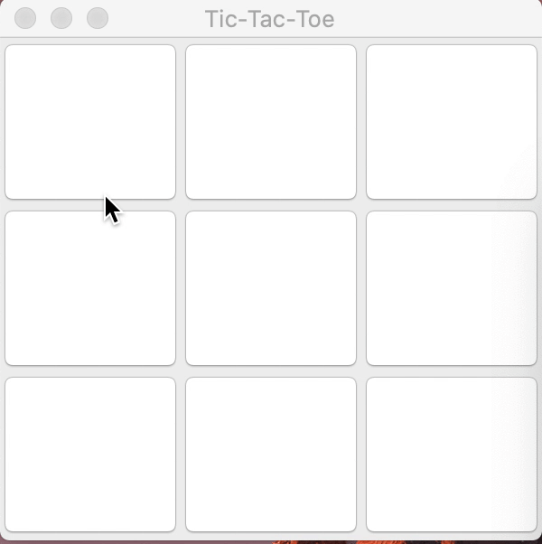

# TicTacToe

## Introduction
TicTacToe is for two players, X and O, who take turns marking the spaces in a 3×3 grid. The player who succeeds in placing three of their marks in a horizontal, vertical, or diagonal row is the winner.

## Features
- Apply Java JFram and Java Swing to create User Interface

- The machine player can make the right move to win and can block the user when they are about to move

- Use Linear Feedback Shift Register (LFSR) Random Number Generator to influence the move of machine

## Example

Machine(O) will block the user(X) when they are about to win:

Machine(O) will make the right move to win if they can:

## Reference
[Wikipedia TicTacToe](https://en.wikipedia.org/wiki/Tic-tac-toe)

[LFSR Random Number Generator](https://www.cs.princeton.edu/courses/archive/fall10/cos126/assignments/lfsr.html)
